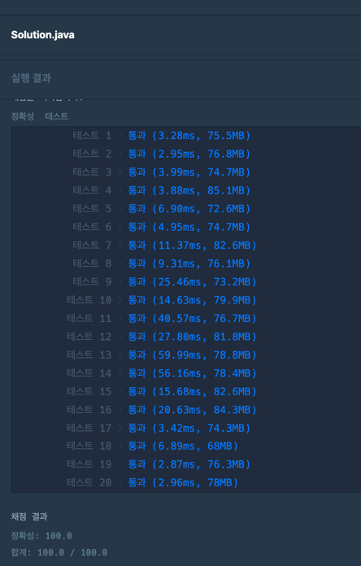

### [Level.2] 이모티콘 할인행사
- 이모티콘 할인율을 미리 계산해 배열에 넣어둔다.
- 이모티콘 할인율은 이모티콘마다 다를 수 있으며 10, 20, 30, 40 중 하나로 설정된다
  - [10, 10, 10, 20] 과 같이 나올 수 있으므로 중복순열을 사용한다.
- user가 가지고있는 비율보다 큰 이모티콘을 구매하고, total값이 user가 가지고있는 가격보다 크다면 이모티콘 플러스를 구매한다.
- list에 모두 넣어 첫번째 cnt값으로 비교하고 두번째는 amount값을 비교해 내림차순 정렬을 해주고 list에 첫번째 값을 리턴해준다.
- 시간복잡도 : O(N * N! * 4)

### 코드

```java

public class kakao_이모티콘_할인행사 {

	public static final List<Result> resultList = new ArrayList<>();
	public static int[] discountRates = {10, 20, 30, 40};
	public static int[][] users = new int[][]{};
	public static int[] emoticons = new int[]{};
	public static int[][] discountAmount = new int[][]{};

	public static void main(String[] args) {
		int[][] users = {{40, 2900}, {23, 10000}, {11, 5200}, {5, 5900}, {40, 3100}, {27, 9200}, {32, 6900}};
		int[] emoticons = {1300, 1500, 1600, 4900};
		int[] answer = solution(users, emoticons);

		for (int i : answer) {
			System.out.print(i + " ");
		}
	}

	public static int[] solution(int[][] users, int[] emoticons) {
		kakao_이모티콘_할인행사.users = users;
		kakao_이모티콘_할인행사.emoticons = emoticons;
		discountAmount = new int[emoticons.length][4];

		// 이모티콘 할인된 가격을 미리 계산해 배열에 넣어준다.
		for (int i = 0; i < emoticons.length; i++) {
			for (int j = 0; j < discountRates.length; j++) {
				int discount = (int)(emoticons[i] * discountRates[j] * 0.01);
				discountAmount[i][j] = (emoticons[i] - discount);
			}
		}

		permutation(new int[emoticons.length], 0);

		// cnt가 같을경우네는 amount로 비교하여 내림차순으로 정렬한다.
		resultList.sort(Comparator.comparingInt((Result o) -> o.cnt)
			.thenComparingInt(o -> o.amount)
			.reversed());

		// 정렬 후 가장 앞에 값을 리턴한다.
		return resultList.get(0).get();
	}

    // 이모티콘 할인율은 [10, 10, 20, 10] 이런식으로 나올 수 있으므로 중복순열을 통해 구해준다.
	public static void permutation(int[] permutationArray, int depth) { 
		if (depth == emoticons.length) {
			calculate(permutationArray);
			return;
		}
		for (int discountRate : discountRates) {
			permutationArray[depth] = discountRate;
			permutation(permutationArray, depth + 1);
		}
	}

	public static void calculate(int[] permutationArray) {
		int cnt = 0;
		int amount = 0;
		for (int[] user : users) {
			int usersRate = user[0];
			int usersTotalAmount = user[1];

			int total = 0;
			for (int j = 0; j < permutationArray.length; j++) {
				if (usersRate <= permutationArray[j]) { // user가 가지고 있는 rate 이상일 경우 구매한다.
					int index = permutationArray[j] / 10 - 1; // 할인율이 20 일때 index = 1 에는 할인율 계산한 값이 들어있다.
					total += discountAmount[j][index]; // 미리 계산한 배열을 활용하여 total을 구한다.
				}
			}

			if (usersTotalAmount <= total) { // user가 가지고 있는 amount보다 구매한 total이 많을경우 이모티콘 플러스를 구매한다.
				cnt++;
			} else { // 더 적을경우는 amount에 더해준다.
				amount += total;
			}
		}
		resultList.add(new Result(cnt, amount));
	}

	public static class Result {
		public int cnt;
		public int amount;

		public Result(int cnt, int amount) {
			this.cnt = cnt;
			this.amount = amount;
		}

		public int[] get() {
			return new int[] {this.cnt, this.amount};
		}
	}
}

```

### 결과


