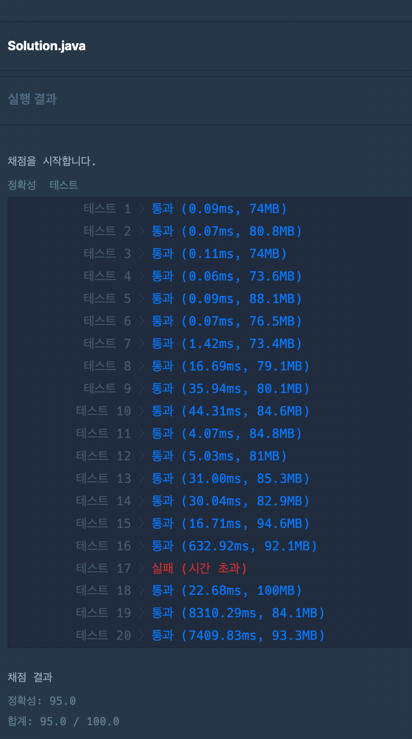

### [Level.2] 택배 배달과 수거하기

- 가장 먼 곳에 배달이나 수거할게 있다면 무조건 가야하기 때문에 배열을 뒤집어서 실행한다.
- 주어진 cap으로 해당 i번째 배달과 수거를 해결하고 남을경우 while 반복문을 이용하여 i-1, i-2 등등 cap을 다 사용할때까지 돌아준다.
- i번째를 돌았지만 아직 처리할 내용이 남아서 다시 처리해야할 경우 다시 한번 반복문을 돌아준다.
- cap을 모두 사용하면 i번째를 기준으로 왔다갔다 했기때문에 answer에 i * 2 한 값을 더해준다.
- 시간복잡도 : O(N^2)

### 코드

```java

public class kakao_택배_배달과_수거하기 {
	public static void main(String[] args) {
		int cap = 2;
		int n = 7;
		int[] deliveries = {1, 0, 2, 0, 1, 0, 2};
		int[] pickups = {0, 2, 0, 1, 0, 2, 0};
		System.out.println(solution(cap, n, deliveries, pickups));
	}

	public static long solution(int cap, int n, int[] deliveries, int[] pickups) {
		long answer = 0;

		for (int i = n-1; i >= -1; i--) {

			// i번째 배달과 수거를 했지만 아직 처리할 내용이 남아서 다시 처리해야할 경우 (cap보다 배달, 수거해야할 값이 더 클 경우)
			if (i != n-1 && (deliveries[i+1] != 0 || pickups[i+1] != 0)) { 
				i += 1;
			}

			if (i == -1) {
				break;
			}

			if (deliveries[i] == 0 && pickups[i] == 0) {
				continue;
			}

			int deliveriesCap = cap; // 배달 cap
			int pickupsCap = cap; // 수거 cap

			int j = i;

			// 해당 deliveries[i], pickups[i]를 해결하고 남은 cap을 처리하기 위해서 while문을 돌아준다.
			while (true) {  
				if (deliveriesCap >= deliveries[j] && pickupsCap >= pickups[j]) { // 배달과 수거를 해도 둘다 cap이 남는경우
					deliveriesCap -= deliveries[j];
					pickupsCap -= pickups[j];
					deliveries[j] = 0;
					pickups[j] = 0;
					j--; // 남은 cap을 반영하기위해 반복문을 다시 돌아준다.
				} else if (deliveriesCap >= deliveries[j]) { // 배달 cap이 남는경우
					deliveriesCap -= deliveries[j];
					pickups[j] -= pickupsCap;
					pickupsCap = 0;
					deliveries[j] = 0;
					j--;
				} else if (pickupsCap >= pickups[j]) { // 수거 cap이 남는경우
					pickupsCap -= pickups[j];
					deliveries[j] -= deliveriesCap;
					deliveriesCap = 0;
					pickups[j] = 0;
					j--;
				} else { // 배달과 수거 모두 처리하는경우
					deliveries[j] -= deliveriesCap;
					pickups[j] -= pickupsCap;
					deliveriesCap = 0;
					pickupsCap = 0;
				}
				if ((deliveriesCap == 0 && pickupsCap == 0)) {
					answer += (i+1) * 2;
					break;
				}
				if (j == -1) {
					answer += (i+1) * 2;
					break;
				}
			}
		}
		return answer;
	}
}

```

### 결과


