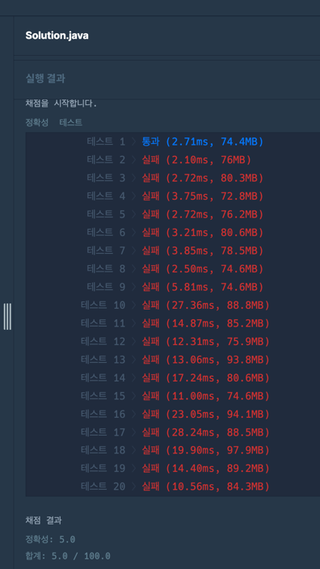

### [Level.3] 표현 가능한 이진트리

- 포화 이진트리는 2^n - 1 이므로 n = 1 부터 시작하여 트리 level을 구한다.
- 포화 이진트리가 될때까지 왼쪽에 '0' 을 계속 추가한다.
- 포화이진트리가 되었을때 자식노드를 가지고있을때 부모노드가 0이면 이진트리를 성립하지 않는다.
- root 노드를 기준으로 left와 right로 나눠 재귀를 통해 계속해서 부모노드가 0인지 확인한다.


### 코드 - 1 (틀림)

```java

public static List<Integer> solution(long[] numbers) {
		List<Integer> answer = new ArrayList<>();

		for (long number : numbers) {
			String binaryNumber = Long.toBinaryString(number);
			boolean check = true;

			if (binaryNumber.length() % 2 == 0) {
				binaryNumber = "0" + binaryNumber;
				char[] chars = binaryNumber.toCharArray();
				for (int i = 1; i < chars.length; i+=2) {
					if (chars[i] == '0') {
						answer.add(0);
						check = false;
						break;
					}
				}
				if (check) {
					answer.add(1);
				}
			} else {
				char[] chars = binaryNumber.toCharArray();
				for (int i = 1; i < chars.length; i+=2) {
					if (chars[i] == '0') {
						answer.add(0);
						check = false;
						break;
					}
				}
				if (check) {
					answer.add(1);
				}
			}
		}


		return answer;
	}

```


### 코드 - 2 (풀이참고)

```java

public static List<Integer> solution(long[] numbers) {
		List<Integer> answer = new ArrayList<>();

		for (long number : numbers) {
			check = false;
			String binaryNumber = Long.toBinaryString(number);

			int level = 1;
			int nodeCount = 1;

			while (binaryNumber.length() > nodeCount) {
				level += 1;
				nodeCount = (int)(Math.pow(2, level) - 1);
			}

			int remain = nodeCount - binaryNumber.length();
			for (int i = 0; i < remain; i++) {
				binaryNumber = "0" + binaryNumber;
			}

			recursive(binaryNumber);

			if (check) {
				answer.add(0);
			} else {
				answer.add(1);
			}
		}

		return answer;
	}

	public static void recursive(String binaryNumber) {
		int root = binaryNumber.length() / 2;
		char[] c = binaryNumber.toCharArray();

		int cnt = 0;

		for (char c1 : c) {
			if (c1 == '0') {
				cnt++;
			}
		}

		if (cnt == c.length) {
			return;
		}

		if (c[root] == '0') {
			check = true;
			return;
		}

		String left = binaryNumber.substring(0, root);
		if (left.length() < 3) {
			return;
		}
		recursive(left);

		String right = binaryNumber.substring(root+1);
		if (right.length() < 3) {
			return;
		}
		recursive(right);
	}

```


### 코드-1 결과



### 코드-2 결과


